Analyzing Trail Race Participation and Performance Across The Iowa Trail
Run Series 2025
================

Members: Samara Feldhacker (samara28), Alina Kirkpatrick (alinayjk)

# Introduction

------------------------------------------------------------------------

The Iowa Trail Run Series is a series of trail running events that has
taken place over the last several years. Each race is held at a
different state park across Iowa, ranging from McFarland Park in Ames to
Yellow River State Forest in northeastern Iowa. With the rise in
popularity of running over the past few years, trail racing has grown
with it. Many people look for specifically trail races because they
enjoy the challenge of soft yet technically demanding trails compared to
flat road races.

In 2025, the Iowa Trail Run Series featured eight different races with a
variety of distance options ranging from a 5K to a half marathon.
Participants can sign up for a full season pass granting access to all
races, or register for individual events. Many of these runners return
year after year, building a tight-knit community around the series.

In addition, the series also includes a points-based competition that
runs throughout the year. Runners earn points by placing in the top 5 of
the Overall Winners category for their gender, or in the top 3 within
their age category. Because of this aspect, this project was motivated
in part by personal interest. I (Samara Feldhacker) have signed up for
the 2026 Iowa trail Run Series and wanted to better understand the
trends among past participants. By analyzing the 2025 race results, we
hope to identify patterns in participation and performance that might
offer useful insights.

In order to analyse trail race participation and performance, we will
also explore the following questions:

1.  Which cities/states are most represented, and do runners from closer
    locations perform differently than those who travel farther?
2.  How does age group affect pace, and does that relationship change
    across different race distances?
3.  How does the performance gap between male and female athletes
    (measured by fastest race times) vary across age categories?
4.  Is there significant a relationship between race distance and the
    number of participants in running events?

# Data

------------------------------------------------------------------------

## Structure

There are eight datasets that need to be combined, one for each race
event offered by the Iowa Trail Run Series in 2025. Race results are
published on the True Timer Racing results portal
(results.truetimeracing.com), which hosts finisher data for each event
as an HTML table. Because the majority of these pages do not offer a
downloadable file, the data was collected via web scraping.

The eight race websites scraped were:

- [Center
  Trails](https://results.truetimeracing.com/results.aspx?CId=16535&RId=1441)
- [Sugar Bottom
  Trails](https://results.truetimeracing.com/results.aspx?CId=16535&RId=1446)
- [Ledges
  Trails](https://results.truetimeracing.com/results.aspx?CId=16535&RId=1478)
- [Summer
  Trails](https://results.truetimeracing.com/results.aspx?CId=16535&RId=1492)
- [Yellow River
  Trails](https://results.truetimeracing.com/results.aspx?CId=16535&RId=1575)
- [MacBride
  Trails](https://results.truetimeracing.com/results.aspx?CId=16535&RId=1593&EId=2)
- [Annett Nature
  Center](https://results.truetimeracing.com/results.aspx?CId=16535&RId=1546&EId=1)
- [Jester Park
  Trails](https://results.truetimeracing.com/results.aspx?CId=16535&RId=1582)

Each event website contains multiple pages of participants across
multiple race distances, including 5K (3.1 mi), 4-mile, 10K (6.2 mi),
8-mile, and half marathon (13.1 mi) options.

## Variables

The necessary variables that are included within the scraped data are:
Pos (position), Name, Time, Category (Age Category), Cat Pos (Category
Position), Gender, Gen Pos (Gender Position), City, State, Finish
(time), Start (time). Distance and Race Name will also need to be
extracted from the website, which allows all of the data to be combined
into one large dataset. Additionally, many of these datasets included
extra variables or were excluding some needed variables, so these would
have to be handled accordingly.

## Data Gathering

Two functions were created to help the scraping process. The first,
get_distance() takes the race name (e.g. “Half Marathon” or “5k Run”)
and returns the distance in miles, since not all event pages included a
distance column within the data. The second function,
information_scrapper() takes a race URL that is the base page of the
race results. Then it will collect all of the race distance links on the
page, iterate through each distance, iterate through each of the pages
of information, extract a results dataset, and add on the distance
column when it is needed. Then it finally returns a single dataframe for
that specific event.

``` r
base_address <- "https://results.truetimeracing.com/"

get_distance <- function(race_name) {
  if(race_name == "4 Mile Run") {
    return(4.0)
  }
  if(race_name == "8 Mile Run") {
    return(8.0)
  }
  if (race_name == "Half Marathon") {
    return(13.1)
  }
  if (race_name == "10k Run") {
    return(6.2)
  }
  if (race_name == "5k Run") {
    return(3.1)
  }
  return(0.0)
}

information_scrapper <- function(url) {
  #First open the base url
  site <- read_html(url)
  
  #First gather all of the races
  race_links <- site %>% html_elements("#ctl00_Content_Main_divEvents .nav-link") %>% html_attr(name="href")
  race_names <- site %>% html_elements("#ctl00_Content_Main_divEvents .nav-link") %>% html_text()
  
  #Get the other page links for that race
  page_links <- site %>% html_elements("#ctl00_Content_Main_grdTopPager a") %>% html_attr(name="href")
  
  #Get the first table
  tables <- site %>% html_table(fill=TRUE)
  data <- tables[[2]]
  colnames(data) <- data[1,]
  data <- data[-1,]
  
  #If there is not distance in col names
  if(!("Dist" %in% names(data))) {
    #Create a new column called distance
    data$Dist <- get_distance(race_names[[1]])
  }
  
  first_iteration = 1
  i <- 1
  
  #Iterate through all of the races
  for(race in race_links) {
    if(!first_iteration) {
      #Read that specific race page
      url <- paste(base_address, race, sep="")
      html <- read_html(url)
      
      #Get the other page links for that race
      page_links <- html %>% html_elements("#ctl00_Content_Main_grdTopPager a") %>% html_attr(name="href")
      
      #Get the first table
      tables <- html %>% html_table(fill=TRUE)
      
      data1 <- tryCatch(tables[[2]], error = function(e) NULL)
      
      if(is.null(data1)) {
        data <- data[, !duplicated(colnames(data))]
        data <- data |>
          filter(Pos != "") |>
          select(-any_of(c("Fav", "Share", "Cat Pos(Gen Pos)")))
        return(data)
      }
      
      colnames(data1) <- data1[1,]
      data1 <- data1[-1,]
      #If there is not distance in col names
      if(!("Dist" %in% names(data1))) {
        #Create a new column called distance
        data1$Dist <- get_distance(race_names[[i]])
      }
      
      #Only rbind with common columns
      common <- intersect(colnames(data), colnames(data1))
      data <- rbind(data[common], data1[common])
    }
    #Iterate through the links in the race
    for(link in page_links) {
      if(!is.na(link)) {
        url2 <- paste(base_address, link, sep="")
        html2 <- read_html(url2)
        
        tables2 <- html2 %>% html_table(fill=TRUE)
        data2 <- tables2[[2]]
        colnames(data2) <- data2[1,]
        data2 <- data2[-1,]
        
        #If there is not distance in col names
        if(!("Dist" %in% names(data2))) {
          #Create a new column called distance
          data2$Dist <- get_distance(race_names[[i]])
        }
        
        #Only rbind with common columns
        common <- intersect(colnames(data), colnames(data2))
        data <- rbind(data[common], data2[common])
      }
    }
    first_iteration <- 0
    i <- i+1
  }
  
  #Filter not needed columns
  data <- data[, !duplicated(colnames(data))]
  
  # Only include all ones where the person finished
  data <- data |>
    filter(Pos != "") |>
    select(!c("Fav", "Share", "Cat Pos(Gen Pos)"))
  
  
  return(data)
}
```

Using these functions, the eight race events were scraped individually:

``` r
center_trails <- information_scrapper("https://results.truetimeracing.com/results.aspx?CId=16535&RId=1441")
sugar_trails <- information_scrapper("https://results.truetimeracing.com/results.aspx?CId=16535&RId=1446")
ledges_trails <- information_scrapper("https://results.truetimeracing.com/results.aspx?CId=16535&RId=1478")
summer_trails <- information_scrapper("https://results.truetimeracing.com/results.aspx?CId=16535&RId=1492")
yellow_trails <- information_scrapper("https://results.truetimeracing.com/results.aspx?CId=16535&RId=1575")
macbride_trails <- information_scrapper("https://results.truetimeracing.com/results.aspx?CId=16535&RId=1593&EId=2")
annett_trails <- information_scrapper("https://results.truetimeracing.com/results.aspx?CId=16535&RId=1546&EId=1")
jester_trails <- information_scrapper("https://results.truetimeracing.com/results.aspx?CId=16535&RId=1582")
```

These eight dataframes will be the base dataframes that will be further
cleaned and combined within the next section.

## Cleaning the data

Not all of the race websites included the same variables, some missing
some variables and others containing extra variables. Because of this,
before combining the dataframes, each one would need to be formatted to
match the others. To do this, columns would have to either be added or
removed.

``` r
#Center and sugar are good

#Ledges is missing City, State, Pace, Start, Finish
ledges_trails <- ledges_trails |>
  mutate(City = "", State = "", Pace = "", Start = "", Finish = "")

#Summer is missing City, State, Pace
summer_trails <- summer_trails |>
  mutate(City = "", State = "", Pace = "")

#Yellow trails is missing city, State
yellow_trails <- yellow_trails |>
  mutate(City = "", State = "")

#Macbride has extra Age variable
macbride_trails <- macbride_trails |>
  select(!c("Age"))

#Annett is missing city, State, Pace
annett_trails <- annett_trails |>
  mutate(City = "", State = "", Pace = "")

#Jester is missing city, State
jester_trails <- jester_trails |>
  mutate(City = "", State = "")
```

Now, since all of the dataframes share the same columns, a
data_cleaner() function was written to ensure consistent variable types
between each of the events. This function takes in the current state of
the data and the trailName. Then, the function removes the Race No,
Pace, and Finish columns (Since Pace is recalculate when needed in a
more useful format, and Finish is a duplicate of Time), and then it
ensures that the variables are all of correct types (Either numeric,
time, or category), and adds on a Trail label corresponding to the
TrailName. The function then returns this updated dataframe.

``` r
data_cleaner <- function(data, trailName) {
  #Remove Race No, Pace, Finish
  dataNew <- data |>
    select(!c("Race No", "Pace", "Finish"))
  
  #Turn gender into a factor
  dataNew$Gender <- factor(dataNew$Gender)
  
  #Turn Pos, Cat Pos, Gen pos, and Dist into a numerical variable
  dataNew$Pos <- as.numeric(dataNew$Pos)
  dataNew$`Cat Pos` <- as.numeric(dataNew$`Cat Pos`)
  dataNew$`Gen Pos` <- as.numeric(dataNew$`Gen Pos`)
  dataNew$Dist <- as.numeric(dataNew$Dist)
  
  #convert time, and start time into the time variable type
  dataNew$Start <- hms(dataNew$Start)
  dataNew$Time <- hms(dataNew$Time)
  
  #Turn category into a factor
  dataNew$Category <- factor(dataNew$Category)
  
  #Turn city and State into a factor - note may need to change later but whatever
  dataNew$City <- factor(dataNew$City)
  dataNew$State <- factor(dataNew$State)
  
  #Add on column for the trailName, and set as factor
  dataNew$Trail <- trailName
  
  dataNew$Trail <- factor(dataNew$Trail)
  
  return(dataNew)
}
```

``` r
center_trails <- data_cleaner(center_trails, "Center")
sugar_trails <- data_cleaner(sugar_trails, "Sugar")
ledges_trails <- data_cleaner(ledges_trails, "Ledges")
```

    ## Warning in .parse_hms(..., order = "HMS", quiet = quiet): Some strings failed
    ## to parse

``` r
summer_trails <- data_cleaner(summer_trails, "Summer")
yellow_trails <- data_cleaner(yellow_trails, "Yellow")
macbride_trails <- data_cleaner(macbride_trails, "MacBride")
```

    ## Warning in .parse_hms(..., order = "HMS", quiet = quiet): Some strings failed
    ## to parse

``` r
annett_trails <- data_cleaner(annett_trails, "Annett")
jester_trails <- data_cleaner(jester_trails, "Jester")
```

    ## Warning in .parse_hms(..., order = "HMS", quiet = quiet): Some strings failed
    ## to parse

Now since all of the dataframes are consistent, and are identifiable
with the TrailName, they can be combined into a single dataset with
rbind(). Additionally, after combing the data, one more cleaning step
will need to be completed. This includes making the Category labels
consist with eachother and ordering them by age.

``` r
trail_races <- rbind(center_trails, sugar_trails, ledges_trails, summer_trails, yellow_trails, macbride_trails, annett_trails, jester_trails)

#Check the levels of Category, and manually rename to make consistent
levels(trail_races$Category)
```

    ##  [1] "14 & under"      "Ages 20-24"      "Ages 25-29"      "Ages 30-34"     
    ##  [5] "Ages 35-39"      "Ages 40-44"      "Ages 45-49"      "Ages 50-54"     
    ##  [9] "Ages 55-59"      "Ages 60-64"      "Ages 65-69"      "Overall Winners"
    ## [13] "Ages 15-19"      "Unknown"         "15-19"           "20-24"          
    ## [17] "25-29"           "30-34"           "35-39"           "40-44"          
    ## [21] "45-49"           "50-54"           "55-59"           "60-64"          
    ## [25] "65-69"           "70-74"           "70+"

``` r
levels(trail_races$Category) <- c("0-14", "20-24", "25-29", "30-34", "35-39", "40-44", "45-49", "50-54", "55-59", "60-64", "65-69", "Overall Winners", "15-19", "Unknown", "15-19", "20-24", "25-29", "30-34", "35-39", "40-44", "45-49", "50-54", "55-59", "60-64", "65-69", "70+", "70+")

#reorder of age groups
levels(trail_races$Category)
```

    ##  [1] "0-14"            "20-24"           "25-29"           "30-34"          
    ##  [5] "35-39"           "40-44"           "45-49"           "50-54"          
    ##  [9] "55-59"           "60-64"           "65-69"           "Overall Winners"
    ## [13] "15-19"           "Unknown"         "70+"

``` r
trail_races$Category <- factor(trail_races$Category, levels = c("0-14", "15-19", "20-24", "25-29", "30-34", "35-39", "40-44", "45-49", "50-54", "55-59", "60-64", "65-69", "70+", "Overall Winners", "Unknown"))

levels(trail_races$Category)
```

    ##  [1] "0-14"            "15-19"           "20-24"           "25-29"          
    ##  [5] "30-34"           "35-39"           "40-44"           "45-49"          
    ##  [9] "50-54"           "55-59"           "60-64"           "65-69"          
    ## [13] "70+"             "Overall Winners" "Unknown"

Finally, city names require manual correction. Several names appear in
all-caps, like AMES, or contained duplication, like Waukeeukee. Because
these errors were inconsistent and not easily detectable
programmatically, they were corrected by hand.

``` r
# Before
levels(trail_races$City)
```

    ##   [1] ""                   "Adel"               "Alburnett"         
    ##   [4] "Altoona"            "Ames"               "AMES"              
    ##   [7] "Ankeny"             "Atlanta"            "Audubon"           
    ##  [10] "Belmond"            "Bondurant"          "Boone"             
    ##  [13] "Clive"              "Colfax"             "De Soto"           
    ##  [16] "Des Moines"         "Earlham"            "Elberon"           
    ##  [19] "Eldora"             "Ellisville"         "Exira"             
    ##  [22] "Fort Worth"         "Grimes"             "Hamlin"            
    ##  [25] "Huxley"             "Indianola"          "Iowa City"         
    ##  [28] "Iowa Falls"         "Janesville"         "JeffersonJefferson"
    ##  [31] "Johnston"           "La Crosse"          "Lamoni"            
    ##  [34] "Linden"             "Marshalltown"       "Maxwell"           
    ##  [37] "Melbourne"          "Minneapolis"        "Mitchellville"     
    ##  [40] "Muscatine"          "Nevada"             "Newton"            
    ##  [43] "North English"      "Norwalk"            "Ogden"             
    ##  [46] "Omaha"              "Osage"              "Oskaloosa"         
    ##  [49] "Otley"              "Parkersburg"        "Pella"             
    ##  [52] "Perry"              "Pleasant Hill"      "POLK CITY"         
    ##  [55] "Prescott"           "Riverside"          "Runnells"          
    ##  [58] "Seattle"            "Slater"             "Solon"             
    ##  [61] "State Center"       "Sully"              "Tama"              
    ##  [64] "Urbandale"          "Waukee"             "Waukeeukee"        
    ##  [67] "West Des Moines"    "Windsor Heights"    "Albia"             
    ##  [70] "Amana"              "Aurora"             "Basco"             
    ##  [73] "Belleville"         "Bennett"            "Bettendorf"        
    ##  [76] "Cambridge"          "Carlisle"           "Cary"              
    ##  [79] "Cedar Falls"        "Cedar Rapids"       "CEDAR RAPIDS"      
    ##  [82] "Center Point"       "Central City"       "Charles City"      
    ##  [85] "Cheyenne"           "Clarence"           "Clinton"           
    ##  [88] "Columbus Junction"  "Coralville"         "Council Bluffs"    
    ##  [91] "Crawfordsville"     "Davenport"          "Decorah"           
    ##  [94] "Dickeyville"        "Dubuque"            "Dyersville"        
    ##  [97] "Dysart"             "Ely"                "Fairbank"          
    ## [100] "Fairfax"            "Fairfield"          "Farley"            
    ## [103] "Fort Dodge"         "Fort Knox"          "Geneseo"           
    ## [106] "Gilbertville"       "Grinnell"           "Grundy Center"     
    ## [109] "Hedrick"            "Hiawatha"           "Hudson"            
    ## [112] "IOWA CITY"          "Iowa CityI"         "Jefferson"         
    ## [115] "Jesup"              "Kalona"             "Keota"             
    ## [118] "Knoxville"          "Liberty"            "Lisbon"            
    ## [121] "Marion"             "Mason City"         "Mechanicsville"    
    ## [124] "Moline"             "Monticello"         "Monticelloo"       
    ## [127] "Mount Pleasant"     "Mount Vernon"       "New London"        
    ## [130] "North Liberty"      "Oak Forest"         "Oelwein"           
    ## [133] "Orange City"        "Ottumwa"            "OttumwaOttumwa"    
    ## [136] "Oxford"             "Packwood"           "Palo"              
    ## [139] "Parnell"            "Platteville"        "Port Byron"        
    ## [142] "Punta Gorda"        "Radcliffe"          "Redfield"          
    ## [145] "Robins"             "Saint Paul"         "Silvis"            
    ## [148] "South Amana"        "Stanwood"           "Strawberry Point"  
    ## [151] "Swisher"            "Tiffin"             "Tipton"            
    ## [154] "Unionville"         "Vinton"             "Waterloo"          
    ## [157] "WATERLOO"           "Waverly"            "Webster City"      
    ## [160] "Wellman"            "Wellsburg"          "West Branch"       
    ## [163] "West Liberty"       "Weston"             "Williamsburg"      
    ## [166] "Winterset"          "Blue Grass"         "Decatur"           
    ## [169] "Des Plaines"        "Durant"             "Eugene"            
    ## [172] "Galveston"          "Independence"       "Le Claire"         
    ## [175] "Lone Tree"          "Madison"            "Northbrook"        
    ## [178] "Peosta"             "Pittsburgh"         "Rochester"         
    ## [181] "Shreveport"         "Sigourney"          "Vernal"

``` r
# Manual change the levels where needed
levels(trail_races$City)[levels(trail_races$City) == "AMES"] <- "Ames"
levels(trail_races$City)[levels(trail_races$City) == "JeffersonJefferson"] <- "Jefferson"
levels(trail_races$City)[levels(trail_races$City) == "POLK CITY"] <- "Polk City"
levels(trail_races$City)[levels(trail_races$City) == "Waukeeukee"] <- "Waukee"
levels(trail_races$City)[levels(trail_races$City) == "CEDAR RAPIDS"] <- "Cedar Rapids"
levels(trail_races$City)[levels(trail_races$City) == "IOWA CITY"] <- "Iowa City"
levels(trail_races$City)[levels(trail_races$City) == "Iowa CityI"] <- "Iowa City"
levels(trail_races$City)[levels(trail_races$City) == "OttumwaOttumwa"] <- "Ottumwa"
levels(trail_races$City)[levels(trail_races$City) == "WATERLOO"] <- "Waterloo"


# After
levels(trail_races$City)
```

    ##   [1] ""                  "Adel"              "Alburnett"        
    ##   [4] "Altoona"           "Ames"              "Ankeny"           
    ##   [7] "Atlanta"           "Audubon"           "Belmond"          
    ##  [10] "Bondurant"         "Boone"             "Clive"            
    ##  [13] "Colfax"            "De Soto"           "Des Moines"       
    ##  [16] "Earlham"           "Elberon"           "Eldora"           
    ##  [19] "Ellisville"        "Exira"             "Fort Worth"       
    ##  [22] "Grimes"            "Hamlin"            "Huxley"           
    ##  [25] "Indianola"         "Iowa City"         "Iowa Falls"       
    ##  [28] "Janesville"        "Jefferson"         "Johnston"         
    ##  [31] "La Crosse"         "Lamoni"            "Linden"           
    ##  [34] "Marshalltown"      "Maxwell"           "Melbourne"        
    ##  [37] "Minneapolis"       "Mitchellville"     "Muscatine"        
    ##  [40] "Nevada"            "Newton"            "North English"    
    ##  [43] "Norwalk"           "Ogden"             "Omaha"            
    ##  [46] "Osage"             "Oskaloosa"         "Otley"            
    ##  [49] "Parkersburg"       "Pella"             "Perry"            
    ##  [52] "Pleasant Hill"     "Polk City"         "Prescott"         
    ##  [55] "Riverside"         "Runnells"          "Seattle"          
    ##  [58] "Slater"            "Solon"             "State Center"     
    ##  [61] "Sully"             "Tama"              "Urbandale"        
    ##  [64] "Waukee"            "West Des Moines"   "Windsor Heights"  
    ##  [67] "Albia"             "Amana"             "Aurora"           
    ##  [70] "Basco"             "Belleville"        "Bennett"          
    ##  [73] "Bettendorf"        "Cambridge"         "Carlisle"         
    ##  [76] "Cary"              "Cedar Falls"       "Cedar Rapids"     
    ##  [79] "Center Point"      "Central City"      "Charles City"     
    ##  [82] "Cheyenne"          "Clarence"          "Clinton"          
    ##  [85] "Columbus Junction" "Coralville"        "Council Bluffs"   
    ##  [88] "Crawfordsville"    "Davenport"         "Decorah"          
    ##  [91] "Dickeyville"       "Dubuque"           "Dyersville"       
    ##  [94] "Dysart"            "Ely"               "Fairbank"         
    ##  [97] "Fairfax"           "Fairfield"         "Farley"           
    ## [100] "Fort Dodge"        "Fort Knox"         "Geneseo"          
    ## [103] "Gilbertville"      "Grinnell"          "Grundy Center"    
    ## [106] "Hedrick"           "Hiawatha"          "Hudson"           
    ## [109] "Jesup"             "Kalona"            "Keota"            
    ## [112] "Knoxville"         "Liberty"           "Lisbon"           
    ## [115] "Marion"            "Mason City"        "Mechanicsville"   
    ## [118] "Moline"            "Monticello"        "Monticelloo"      
    ## [121] "Mount Pleasant"    "Mount Vernon"      "New London"       
    ## [124] "North Liberty"     "Oak Forest"        "Oelwein"          
    ## [127] "Orange City"       "Ottumwa"           "Oxford"           
    ## [130] "Packwood"          "Palo"              "Parnell"          
    ## [133] "Platteville"       "Port Byron"        "Punta Gorda"      
    ## [136] "Radcliffe"         "Redfield"          "Robins"           
    ## [139] "Saint Paul"        "Silvis"            "South Amana"      
    ## [142] "Stanwood"          "Strawberry Point"  "Swisher"          
    ## [145] "Tiffin"            "Tipton"            "Unionville"       
    ## [148] "Vinton"            "Waterloo"          "Waverly"          
    ## [151] "Webster City"      "Wellman"           "Wellsburg"        
    ## [154] "West Branch"       "West Liberty"      "Weston"           
    ## [157] "Williamsburg"      "Winterset"         "Blue Grass"       
    ## [160] "Decatur"           "Des Plaines"       "Durant"           
    ## [163] "Eugene"            "Galveston"         "Independence"     
    ## [166] "Le Claire"         "Lone Tree"         "Madison"          
    ## [169] "Northbrook"        "Peosta"            "Pittsburgh"       
    ## [172] "Rochester"         "Shreveport"        "Sigourney"        
    ## [175] "Vernal"

## Variables

After cleaning and combining all events, the final dataset (trail_races)
contains:

- Pos: Overall finishing position
- Name: Runner’s First and Last Name
- Time: Official finish time (In hours:minutes:seconds)
- Category: Age Category
- Cat Pos: Finishing position within age category
- Gender: The Runner’s Gender
- Gen Pos: Finish position within gender
- City: Runner’s home city
- State: Runner’s home state
- Start: The start Time of the runner
- Dist: Race distance in miles
- Trail: Which race event the data came from

A summary of the dataset is shown below:

``` r
summary(trail_races)
```

    ##       Pos             Name                Time                         
    ##  Min.   :  1.00   Length:1669        Min.   :17M 29S                   
    ##  1st Qu.: 24.00   Class :character   1st Qu.:37M 49.3200000000002S     
    ##  Median : 49.00   Mode  :character   Median :53M 41.1100000000001S     
    ##  Mean   : 57.11                      Mean   :1H 7M 43.7139544637507S   
    ##  3rd Qu.: 82.00                      3rd Qu.:1H 21M 43.6999999999998S  
    ##  Max.   :199.00                      Max.   :4H 26M 25S                
    ##                                                                        
    ##             Category      Cat Pos          Gender       Gen Pos      
    ##  35-39          :282   Min.   : 1.000   Female:779   Min.   :  1.00  
    ##  40-44          :263   1st Qu.: 2.000   Male  :890   1st Qu.: 12.00  
    ##  30-34          :234   Median : 3.000                Median : 25.00  
    ##  25-29          :162   Mean   : 4.189                Mean   : 29.44  
    ##  45-49          :154   3rd Qu.: 6.000                3rd Qu.: 42.00  
    ##  Overall Winners:101   Max.   :20.000                Max.   :114.00  
    ##  (Other)        :473                                                 
    ##             City           State         Start                         
    ##               :938            :931   Min.   :1S                        
    ##  Iowa City    : 68   Iowa     :689   1st Qu.:8H 7M 19.2999999999993S   
    ##  Cedar Rapids : 58   Illinois : 17   Median :9H 4M 5.88000000000102S   
    ##  Des Moines   : 53   Wisconsin:  7   Mean   :9H 40M 1.86328641801811S  
    ##  North Liberty: 30   Nebraska :  5   3rd Qu.:9H 58M 50.9000000000015S  
    ##  Ankeny       : 26   Minnesota:  4   Max.   :19H 46M 40S               
    ##  (Other)      :496   (Other)  : 16   NA's   :248                       
    ##       Dist             Trail    
    ##  Min.   : 3.100   Sugar   :367  
    ##  1st Qu.: 3.100   Ledges  :246  
    ##  Median : 4.000   Jester  :228  
    ##  Mean   : 5.828   Summer  :199  
    ##  3rd Qu.: 6.800   MacBride:188  
    ##  Max.   :13.100   Center  :184  
    ##                   (Other) :257

# Results

------------------------------------------------------------------------

## Which cities/states are most represented, and do runners from closer locations perform differently than those who travel farther?

When answering the first part of the question, which cities/states are
most represented, a bar chart would show the most popular home
cities/state from the participants. The top 20 cities are plotted below:

``` r
# Making a data set a copy of the original for this question, and remove not needed variables
trail_races_q1 <- trail_races |>
  select(!c("Name", "Pos", "Cat Pos", "Gen Pos", "Start"))

trail_races_q1 |>
  filter(!is.na(City), City != "") |>
  count(City, sort = TRUE) |>
  slice_head(n = 20) |>
  mutate(City = reorder(City, n)) |>
  ggplot(aes(x = n, y = City, fill = factor(n))) +
  geom_col(show.legend = FALSE) +
  geom_text(aes(label = n), hjust = -0.2, size = 3.2) +
  labs(title = "Top 20 Cities by Trail Race Participation",
       x = "Number of participants",
       y = NULL) +
  scale_colour_discrete() +
  theme_bw()
```

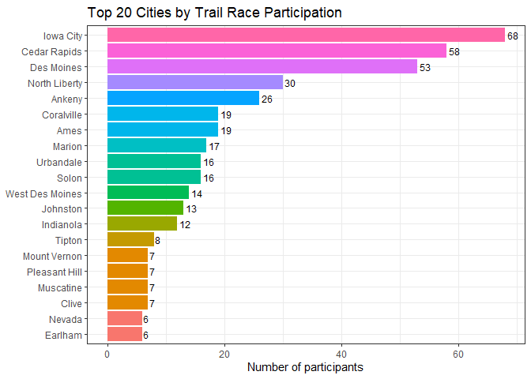<!-- -->

As expected, participation is dominated by larger Iowa population
centers, with Iowa City, Cedar Rapids, and Des Moines appearing near the
top. This makes sense given their population size and proximity to many
of the race locations.

The same approach was applied to states:

``` r
trail_races_q1 |>
  filter(!is.na(State), State != "") |>
  count(State, sort = TRUE) |>
  mutate(State = reorder(State, n)) |>
  ggplot(aes(x = n, y = State, fill = factor(n))) +
  geom_col(show.legend = FALSE) +
  geom_text(aes(label = n), hjust = -0.2, size = 3.2) +
  labs(title = "States by Trail Race Participation",
       x = "Number of participants",
       y = NULL) +
  scale_colour_discrete() +
  theme_bw()
```

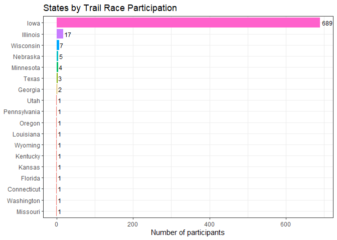<!-- -->

As shown above, nearly all participants are from Iowa, with small
representation from neighboring Midwest states. Since the Race Series is
located within Iowa this makes sense and would be expected.

Now when answering the second part of the question, whether runners from
farther away perform differently, a performance factor would have to be
selected. In this case, time would not be a good factor because of the
different race distances, and instead deriving pace in min/mile would be
an easy way to compare performance between groups. Pace was calculated
from the existing `Time` and `Dist` variables:

``` r
trail_races_q1 <- trail_races_q1 |>
  mutate(time_sec = as.numeric(Time),
         pace_min_mile = (time_sec / 60) / Dist)
```

In order to calculate the distance between the race location and the
runner’s home location,
[geocoder](https://cran.r-project.org/web/packages/IRexamples/vignettes/Ex-05-Geocoding-Addresses.html)
was used. Geocoder allows for an address to be entered, and the lat/long
coordinates would be returned. In this case, the address had to be City,
State_Abbr. These were derived for each of the runners. Then, the race
location lat/long were manually derived. Finally, the straight line
distance from each runner’s home to the specific race location was
calculate using the Haversine function.

``` r
#First remove any null city/state values
trail_races_q1 <- trail_races_q1 |>
  filter(!is.na(State), State != "", !is.na(City), City != "")

# get the state abbreviation for each State
trail_races_q1 <- trail_races_q1 |>
  mutate(State_abbr = state.abb[match(State, state.name)])

# Combine city and state into 1 address
trail_races_q1 <- trail_races_q1 |>
  mutate(full_address = paste(City, State_abbr, sep = ", "))

# Get the lat and long from the address
trail_races_q1 <- trail_races_q1 |>
  geocode(address = full_address, method = "osm", lat = latitude, long = longitude)
```

    ## Passing 174 addresses to the Nominatim single address geocoder

    ## Query completed in: 176.6 seconds

``` r
# Now, I'm going to get the location of the races, note: I am manually doing this by looking up the venue locations and the corresponding lat/long. I could also make this a function, but doing it by hand would be easier in this case.

race_locations <- data.frame(
  Trail = c("Center", "Sugar", "Ledges", "Summer", "Yellow", "MacBride", "Annett", "Jester"),
  race_latitude = c(41.58687, 41.80723, 41.87665, 42.02676, 43.20060, 41.80723, 41.3605, 41.76110),
  race_longitude = c(-93.62495, -91.49406, -93.82328, -93.61704, -91.15254, -91.49406, -93.56133, -93.82439)
)

# Calculate distance from the race location

# Combine race_locations data and the trail_races data
trail_races_q1 <- trail_races_q1 |>
  left_join(race_locations, by = "Trail") |>
  rowwise() |>
  mutate(dist_to_race_miles = round(distHaversine(c(race_longitude,race_latitude), c(longitude, latitude)) * 0.00062137), 2) |>
  ungroup()
```

The plots below show travel distance vs. pace across all runners, first
with no distance filter and then filtered to runners within 500 miles to
remove some outliers:

``` r
# Everyone

trail_races_q1 |>
  ggplot(aes(x = dist_to_race_miles, y = pace_min_mile)) +
  geom_point(alpha = 0.3, size = 1.5) +
  geom_smooth() +
  scale_colour_brewer(type = "qual", palette = "Set1") +
  labs(title = "Travel Distance vs. Pace",
       x = "Distance Travelled to Race (miles)",
       y = "Pace (min/mile)") +
  theme_bw()
```

    ## `geom_smooth()` using method = 'loess' and formula = 'y ~ x'

    ## Warning: Removed 1 row containing non-finite outside the scale range
    ## (`stat_smooth()`).

    ## Warning: Removed 1 row containing missing values or values outside the scale range
    ## (`geom_point()`).

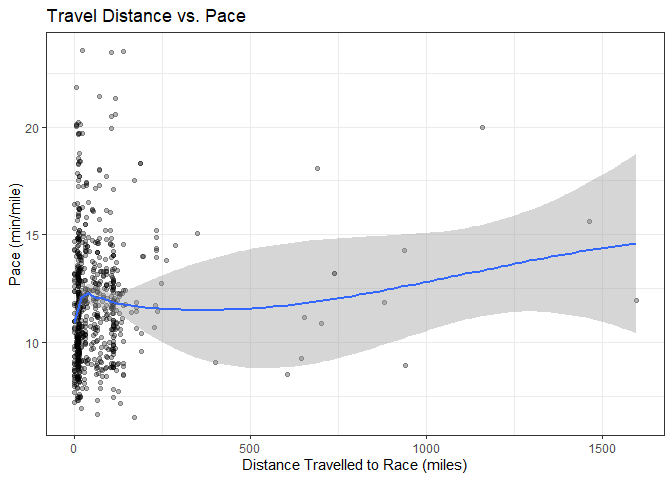<!-- -->

``` r
# Within 500 miles
trail_races_q1 |>
  filter(dist_to_race_miles <= 500) |>
  ggplot(aes(x = dist_to_race_miles, y = pace_min_mile)) +
  geom_point(alpha = 0.3, size = 1.5) +
  geom_smooth() +
  scale_colour_brewer(type = "qual", palette = "Set1") +
  labs(title = "Travel Distance vs. Pace",
       x = "Distance Travelled to Race (miles)",
       y = "Pace (min/mile)") +
  theme_bw()
```

    ## `geom_smooth()` using method = 'loess' and formula = 'y ~ x'

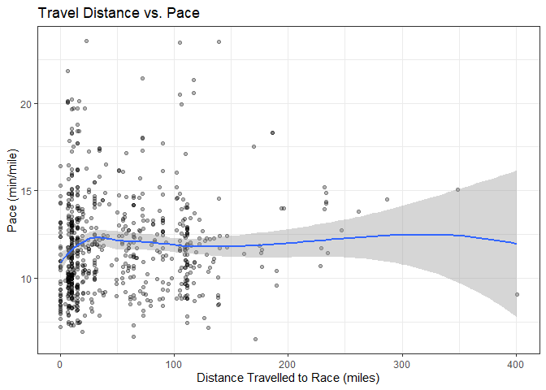<!-- -->

Within the plots above, there is no strong linear relationship between
the travel distance and pace overall. The only thing notable is that the
pace starts as faster for those within the city the race is located in,
but as the participants get farther away, the pace goes up slightly, but
then remains stable for all distances.

Now, breaking the data down by gender reveals something interesting:

``` r
trail_races_q1 |>
  filter(Dist <= 4, dist_to_race_miles <= 500) |>
  ggplot(aes(x = dist_to_race_miles, y = pace_min_mile, color = Gender)) +
  geom_point(alpha = 0.3, size = 1.5) +
  geom_smooth() +
  scale_colour_brewer(type = "qual", palette = "Set1") +
  labs(title = "Travel Distance vs. Pace for races 4 miles or less",
       x = "Distance Travelled to Race (miles)",
       y = "Pace (min/mile)", color = "Gender") +
  theme_bw()
```

    ## `geom_smooth()` using method = 'loess' and formula = 'y ~ x'

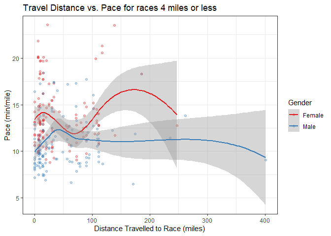<!-- -->

``` r
trail_races_q1 |>
  filter(Dist > 4, dist_to_race_miles <= 500) |>
  ggplot(aes(x = dist_to_race_miles, y = pace_min_mile, color = Gender)) +
  geom_point(alpha = 0.3, size = 1.5) +
  geom_smooth() +
  scale_colour_brewer(type = "qual", palette = "Set1") +
  labs(title = "Travel Distance vs. Pace for races over 4 miles",
       x = "Distance Travelled to Race (miles)",
       y = "Pace (min/mile)", color = "Gender") +
  theme_bw()
```

    ## `geom_smooth()` using method = 'loess' and formula = 'y ~ x'

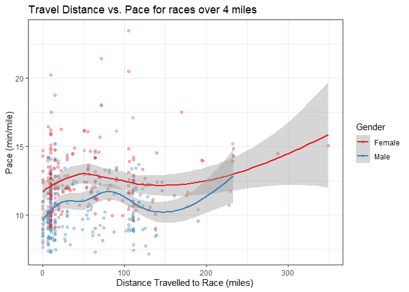<!-- -->

The slight trend where the pace starts faster for those within the city
where the race is at shows up again, but there are some differences
between gender. For Females who race less than 4 miles, there is a
significant decrease in pace when someone had to travel about 50 miles
to get to the race location. The pace then trends up again after 50
miles traveled. While Males of the same distance have the same trend as
all genders shown above. Now when it comes to races over 4 miles, it is
more obvious that the further someone has traveled there is an increase
in pace. Males also have a further dip in pace at around 125 miles,
though not as durastic as the Females for distances less than 4 miles.

Lastly, splitting by age category shows how pace varies with travel
distance within each age group:

``` r
#display the data
trail_races_q1 |>
  filter(dist_to_race_miles <= 200) |>
  ggplot(aes(x = dist_to_race_miles, y = pace_min_mile, color = Category)) +
  geom_point(alpha = 0.2, size = 1.5) +
  geom_smooth(se = FALSE, method = "loess", span = 0.75) + 
  labs(title = "Travel Distance vs. Pace",
       x = "Distance Travelled to Race (miles)",
       y = "Pace (min/mile)", color = "Age Category") +
  theme_bw()
```

    ## `geom_smooth()` using formula = 'y ~ x'

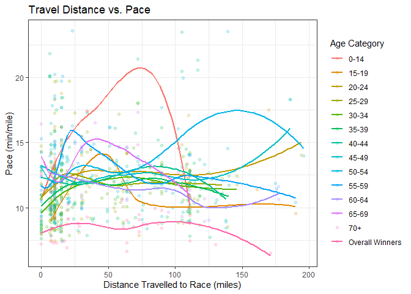<!-- -->

Older age groups show slower paces regardless of travel distance. This
means that age is a likely a stronger predictor of performance rather
than distance traveled.

## How does age group affect pace, and does that relationship change across different race distances?

First, a new data set was created for this question by recalculating
pace and removing variables not needed. Runners categorized as “Overall
Winners” or “Unknown” were excluded, since their age is not listed.

``` r
trail_races_q2 <- trail_races |>
  mutate(time_sec = as.numeric(Time),
         pace_min_mile = (time_sec / 60) / Dist) |>
  select(!c("Name", "Pos", "Cat Pos", "Gen Pos", "Start", "City", "State"))
```

``` r
trail_races_q2 <- trail_races_q2 |>
  filter(!is.na(Category), !Category %in% c("Overall Winners","Unknown"))
```

A boxplot of pace by age group gives an initial overview of the
relationship:

``` r
trail_races_q2 |>
  ggplot(aes(x = Category, y = pace_min_mile, fill = Category)) +
  geom_boxplot(alpha = 0.65, outlier.alpha = 0.25, outlier.size = 1, show.legend = FALSE) +
  labs(title = "Pace by age group",
       x = "Age group",
       y = "Pace (min/mile)") +
  theme_bw()
```

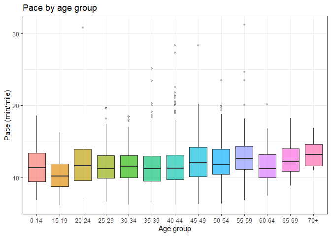<!-- -->

It is generally shown that younger runners within 15-44 range tend to
have slightly faster median paces when compared to the older age groups.
There is a general slight trend upwards within all of the age groups.

To see if this pattern holds across different race distances, including
3.1, 3.4, 3.65, 4, 6.2, 6.8, 8, 13.1 miles, these will be group together
into 3 distinctive groups. Short (3-4 miles), Mid (6-8 miles), and Long
(13.1 miles). This will be done to allow for cleaner comparisons between
race types. Here a new distance_category label will be created to
signifying which group the race belongs to:

``` r
levels(factor(trail_races_q2$Dist))
```

    ## [1] "3.1"  "3.4"  "3.65" "4"    "6.2"  "6.8"  "8"    "13.1"

``` r
trail_races_q2$Dist_category <- factor(trail_races_q2$Dist)

levels(trail_races_q2$Dist_category) <- c("Short (3-4 mi)", "Short (3-4 mi)", "Short (3-4 mi)", "Short (3-4 mi)", "Mid (6-8 mi)", "Mid (6-8 mi)", "Mid (6-8 mi)", "Long (13.1 mi)")

levels(trail_races_q2$Dist_category)
```

    ## [1] "Short (3-4 mi)" "Mid (6-8 mi)"   "Long (13.1 mi)"

The boxplots below show pace by age group, faceted by distance category:

``` r
trail_races_q2 |>
  ggplot(aes(x = Category, y = pace_min_mile, fill = Category)) +
  geom_boxplot(alpha = 0.65,outlier.alpha = 0.25,outlier.size = 1, show.legend = FALSE) +
  facet_wrap(~ Dist_category, scales = "free_y", ncol = 1) +
  labs(title = "Pace by age group across race distances",
       x = "Age group",
       y = "Pace (min/mile)") +
  theme_bw()
```

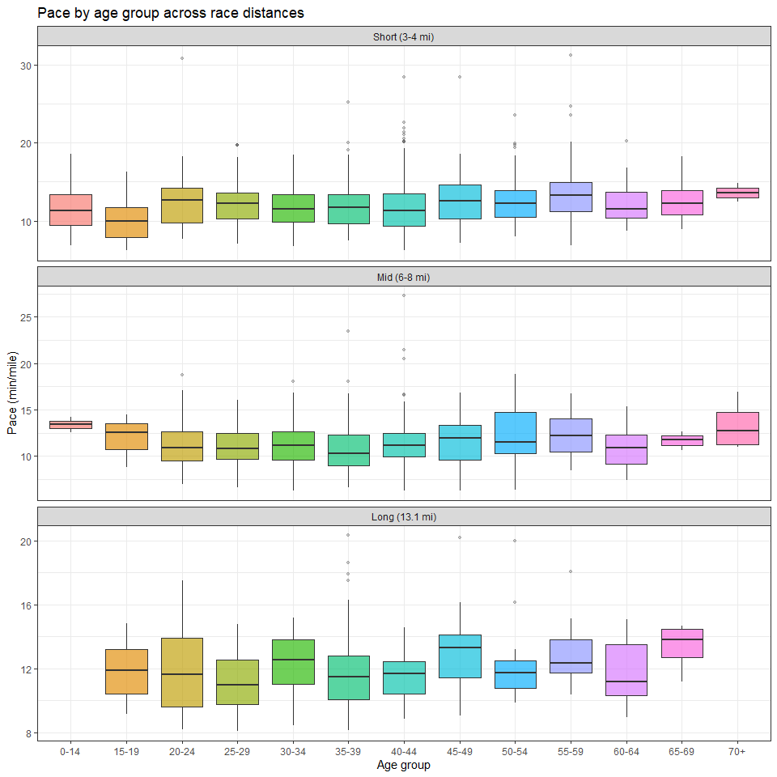<!-- -->

The age-pace relationships still shows up within this boxplot between
all three distance categories. But the spread in pace does become longer
within the longer distances. An interesting outlier also appears, which
is that within the 60-64 age group, there are some fast people who are
shown within the half marathon distance. To summarize this data more
clearly, a heat map of median pace by age group and distance category is
shown below:

``` r
heatmap <- trail_races_q2 |>
  group_by(Category, Dist_category) |>
  summarise(median_pace = median(pace_min_mile, na.rm = TRUE), n = n(), .groups = "drop") |>
  filter(!is.na(median_pace))

mid_pace <- median(heatmap$median_pace)

heatmap |>
  ggplot(aes(x = Dist_category, y = Category, fill = median_pace)) +
  geom_tile(colour= "white") +
  geom_text(aes(label = sprintf("%d:%02d", floor(median_pace),round((median_pace %% 1) * 60))), size = 3) +
  scale_fill_gradient2(low = "green",mid = "white",high = "red", midpoint = median(mid_pace), name = "Median pace\n(min/mile)") +
  labs(title = "Median pace heat map — age group x race distance", 
       subtitle = "Green = faster, red = slower",
       x = "Race distance", 
       y = "Age group") +
  theme_bw()
```

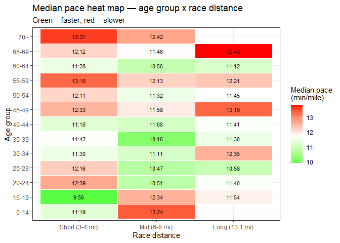<!-- -->

The heat map makes the relationship between age, pace, and distance much
easier to read. The fastest paces are located within the 35-39 age group
at the mid distances, and the 15-19 age group at the short distances.
The slowest paces are in the older age groups in general and both at the
long and short distance categories. An interesting trend that is shown
overall is that most of the age groups get faster between the short vs
mid distances, and the paces for the long distances are about the same
as the short distances. This is likely due to the fact that newer and
slower runners are more likely to run those shorter distances, and more
experienced runners run at the longer distances. The exception to this
trend are those people 0-19, where they become slower as the distance is
increased. This is likely due to the fact that younger people mostly
train speed in school sports, and they do not focus on endurance runs.

## How does the performance gap between male and female athletes (measured by fastest race times) vary across age categories?

For easier time comparisons, I made a new column where the time is
mutated to be in seconds:

``` r
Q3_df <- trail_races %>%
  mutate(time_seconds = as.numeric(Time))

Q3_df
```

    ## # A tibble: 1,669 × 13
    ##      Pos Name         Time       Category `Cat Pos` Gender `Gen Pos` City  State
    ##    <dbl> <chr>        <Period>   <fct>        <dbl> <fct>      <dbl> <fct> <fct>
    ##  1     1 Caleb Soren… 26M 33.82S Overall…         1 Male           1 Pres… Iowa 
    ##  2     2 Joshua Burb… 28M 46.57S Overall…         2 Male           2 Des … Iowa 
    ##  3     3 Dillon Ver … 29M 38.18S Overall…         3 Male           3 Runn… Iowa 
    ##  4     4 Anthony All… 31M 26.23S 30-34            1 Male           4 Colf… Iowa 
    ##  5     5 Nathan Holm… 32M 4.91S  30-34            2 Male           5 Des … Iowa 
    ##  6     6 Ryan Klumpe… 33M 23.17S 30-34            3 Male           6 Des … Iowa 
    ##  7     7 Jeremy Muel… 33M 37.84S 45-49            1 Male           7 Wauk… Iowa 
    ##  8     8 Michael Mey… 33M 43.37S 35-39            1 Male           8 West… Iowa 
    ##  9     9 Chad Mokles… 34M 2.33S  30-34            4 Male           9 Wind… Iowa 
    ## 10    10 Brian Stewa… 34M 24S    50-54            1 Male          10 Wauk… Iowa 
    ## # ℹ 1,659 more rows
    ## # ℹ 4 more variables: Start <Period>, Dist <dbl>, Trail <fct>,
    ## #   time_seconds <dbl>

Now, I will remove the 0.0 distance:

``` r
Q3_df <- Q3_df %>%
  filter(!is.na(Dist), Dist != 0.0)

unique(Q3_df$Dist) #Checking it was removed (it was)
```

    ## [1]  4.00  8.00 13.10  6.80  3.65  6.20  3.10  3.40

I will also create a new column that removes the category variable
“Overall Winners” for simplicity:

``` r
Q3_df <- Q3_df %>%
  filter(Category != "Overall Winners")

Q3_df # checking it worked
```

    ## # A tibble: 1,568 × 13
    ##      Pos Name         Time       Category `Cat Pos` Gender `Gen Pos` City  State
    ##    <dbl> <chr>        <Period>   <fct>        <dbl> <fct>      <dbl> <fct> <fct>
    ##  1     4 Anthony All… 31M 26.23S 30-34            1 Male           4 Colf… Iowa 
    ##  2     5 Nathan Holm… 32M 4.91S  30-34            2 Male           5 Des … Iowa 
    ##  3     6 Ryan Klumpe… 33M 23.17S 30-34            3 Male           6 Des … Iowa 
    ##  4     7 Jeremy Muel… 33M 37.84S 45-49            1 Male           7 Wauk… Iowa 
    ##  5     8 Michael Mey… 33M 43.37S 35-39            1 Male           8 West… Iowa 
    ##  6     9 Chad Mokles… 34M 2.33S  30-34            4 Male           9 Wind… Iowa 
    ##  7    10 Brian Stewa… 34M 24S    50-54            1 Male          10 Wauk… Iowa 
    ##  8    11 Luis Gomez   34M 42.08S 35-39            2 Male          11 Des … Iowa 
    ##  9    12 Michael Van… 35M 7.37S  35-39            3 Male          12 Anke… Iowa 
    ## 10    14 Jason Pugh   35M 20.28S 30-34            5 Male          13 West… Iowa 
    ## # ℹ 1,558 more rows
    ## # ℹ 4 more variables: Start <Period>, Dist <dbl>, Trail <fct>,
    ## #   time_seconds <dbl>

Because there are inconsistencies in some of the age catergories across
race distances, we will only be removing the following age categories:
0-14, 15-19, 65-69, 70+

``` r
Q3_df <- Q3_df %>%
  filter(!Category %in% c("0-14", "15-19", "65-69", "70+"))

unique(Q3_df$Category)
```

    ##  [1] 30-34   45-49   35-39   50-54   40-44   20-24   55-59   60-64   25-29  
    ## [10] Unknown
    ## 15 Levels: 0-14 15-19 20-24 25-29 30-34 35-39 40-44 45-49 50-54 55-59 ... Unknown

I will now find the top 3 runners for each trail, for each distance on
the trail, based on gender, and age:

``` r
top3_runners <- Q3_df %>%
  group_by(Trail, Dist, Category, Gender) %>%
  arrange(time_seconds, .by_group = TRUE) %>%
  mutate(rank_in_group = row_number()) %>%
  filter(rank_in_group <= 3)

top3_runners <- top3_runners %>%
  select(
    Trail,
    Dist, 
    Category,
    Gender,
    Name,
    time_seconds,
    rank_in_group
  )

top3_runners
```

    ## # A tibble: 732 × 7
    ## # Groups:   Trail, Dist, Category, Gender [297]
    ##    Trail   Dist Category Gender Name             time_seconds rank_in_group
    ##    <fct>  <dbl> <fct>    <fct>  <chr>                   <dbl>         <int>
    ##  1 Center     4 20-24    Female Haileigh Steffen        3122.             1
    ##  2 Center     4 20-24    Male   Ashwin Sinha            2208.             1
    ##  3 Center     4 25-29    Female Shay Vandersluis        2525.             1
    ##  4 Center     4 25-29    Female Molly Luzbetak          2629.             2
    ##  5 Center     4 25-29    Female Devyn Atzen             4720.             3
    ##  6 Center     4 25-29    Male   Calvin Knuth            2639.             1
    ##  7 Center     4 25-29    Male   AJ Stills               2782.             2
    ##  8 Center     4 25-29    Male   Rian Simpson            2951.             3
    ##  9 Center     4 30-34    Female Danielle Curtis         2491.             1
    ## 10 Center     4 30-34    Female Olivia Meyer            2491.             2
    ## # ℹ 722 more rows

``` r
# Making sure it made a new df instead of altering the original
trail_races
```

    ## # A tibble: 1,669 × 12
    ##      Pos Name         Time       Category `Cat Pos` Gender `Gen Pos` City  State
    ##    <dbl> <chr>        <Period>   <fct>        <dbl> <fct>      <dbl> <fct> <fct>
    ##  1     1 Caleb Soren… 26M 33.82S Overall…         1 Male           1 Pres… Iowa 
    ##  2     2 Joshua Burb… 28M 46.57S Overall…         2 Male           2 Des … Iowa 
    ##  3     3 Dillon Ver … 29M 38.18S Overall…         3 Male           3 Runn… Iowa 
    ##  4     4 Anthony All… 31M 26.23S 30-34            1 Male           4 Colf… Iowa 
    ##  5     5 Nathan Holm… 32M 4.91S  30-34            2 Male           5 Des … Iowa 
    ##  6     6 Ryan Klumpe… 33M 23.17S 30-34            3 Male           6 Des … Iowa 
    ##  7     7 Jeremy Muel… 33M 37.84S 45-49            1 Male           7 Wauk… Iowa 
    ##  8     8 Michael Mey… 33M 43.37S 35-39            1 Male           8 West… Iowa 
    ##  9     9 Chad Mokles… 34M 2.33S  30-34            4 Male           9 Wind… Iowa 
    ## 10    10 Brian Stewa… 34M 24S    50-54            1 Male          10 Wauk… Iowa 
    ## # ℹ 1,659 more rows
    ## # ℹ 3 more variables: Start <Period>, Dist <dbl>, Trail <fct>

I am now going to summarize the average times for each age group and
gender per race and distance:

``` r
gap_run_time <- Q3_df %>%
  group_by(Trail, Dist, Category, Gender) %>%
  summarise(
    avg_time = mean(time_seconds, na.rm = TRUE),
    .groups = "drop"
  )

gap_run_time
```

    ## # A tibble: 297 × 5
    ##    Trail   Dist Category Gender avg_time
    ##    <fct>  <dbl> <fct>    <fct>     <dbl>
    ##  1 Center     4 20-24    Female    3122.
    ##  2 Center     4 20-24    Male      2208.
    ##  3 Center     4 25-29    Female    3867.
    ##  4 Center     4 25-29    Male      2885.
    ##  5 Center     4 30-34    Female    2919.
    ##  6 Center     4 30-34    Male      2194.
    ##  7 Center     4 35-39    Female    3422.
    ##  8 Center     4 35-39    Male      2565.
    ##  9 Center     4 40-44    Female    4090.
    ## 10 Center     4 40-44    Male      2610.
    ## # ℹ 287 more rows

From here, I will create a grouped bar-chart to visualize the data:

``` r
#for better labeling
gap_run_time$Dist_label <- paste0("Dist - ", gap_run_time$Dist)


#the actual graph
ggplot(gap_run_time, aes(x = Category, y = avg_time, fill = Gender)) +
  geom_bar(stat = "identity", position = "dodge") +
  
  scale_fill_manual(values = c("Female" = "pink",
                               "Male" = "lightblue")) +
  
  facet_wrap(~Dist_label) +
  
  labs(
    title = "Performance Gap Between Male and Female Runners",
    x = "Age Category",
    y = "Average Time (seconds)"
  ) +
  
  theme_minimal() +
  theme(
    axis.text.x = element_text(angle = 45, hjust = 1),
    strip.text = element_text(face = "bold"),
    legend.position = "top"
  )
```

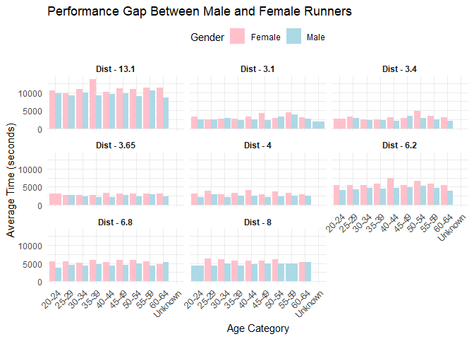<!-- -->

Conclusion: from this bar chart we can see that male runners
consistently have faster average race distances. The performance gap is
present in every subgroup but does vary in magnitude depending age. It
tends to be smaller in younger age groups and become varied in older age
groups, however female average times increase more notably.

Overall, while gender does have an association with performance
differences, the size gap is influenced more by age, and varied across
race distances.

## Is there a relationship between race distance and the number of participants in running events (does race distance affect number of participants)?

First, I need to find the number of participants at the races, keeping
in mind I do not want to count those at 0.0, and keeping them grouped by
distance as well:

``` r
participants <- trail_races %>%
  filter(!is.na(Dist), Dist != 0.0) %>%
  group_by(Trail, Dist) %>%
  summarise(
    n_participants = n(),
    .groups = "drop"
  )


participants
```

    ## # A tibble: 18 × 3
    ##    Trail     Dist n_participants
    ##    <fct>    <dbl>          <int>
    ##  1 Center    4               112
    ##  2 Center    8                72
    ##  3 Sugar     3.65            103
    ##  4 Sugar     6.8             150
    ##  5 Sugar    13.1             114
    ##  6 Ledges    3.1             150
    ##  7 Ledges    6.2              96
    ##  8 Summer    3.1             199
    ##  9 Yellow    3.1              24
    ## 10 Yellow    6.2              34
    ## 11 Yellow   13.1              64
    ## 12 MacBride  3.4              68
    ## 13 MacBride  6.8              62
    ## 14 MacBride 13.1              58
    ## 15 Annett    3.1              81
    ## 16 Annett    6.2              54
    ## 17 Jester    3.1             129
    ## 18 Jester    6.2              99

Now that I have all the participant counts, we can visualize the data. I
added red man dots to visualize the mean number of runners in each race
distance.

``` r
ggplot(participants, aes(x = factor(Dist), y = n_participants)) +
  geom_jitter(width = 0.15, alpha = 0.6, size = 2) +
  stat_summary(fun = mean, geom = "point", size = 4, color = "red") +
  labs(
    title = "Participants by Race Distance",
    x = "Distance",
    y = "Number of Participants"
  ) +
  theme_minimal()
```

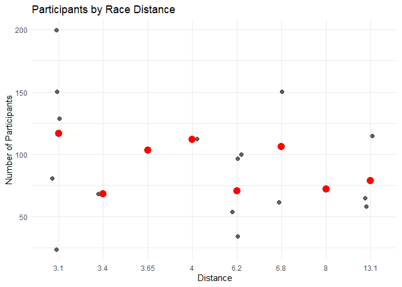<!-- -->

From here, I am going to use descriptive statistics in order to find if
there is evidence that race distance affects number of participants.

``` r
participants_summary <- participants %>%
  group_by(Dist) %>%
  summarise(
    mean_participants = mean(n_participants),
    median_participants = median(n_participants),
    sd_participants = sd(n_participants),
    min_participants = min(n_participants),
    max_participants = max(n_participants),
    .groups = "drop"
  )

cor(participants$Dist, participants$n_participants)
```

    ## [1] -0.2528598

``` r
#-0.3384045

participants_summary
```

    ## # A tibble: 8 × 6
    ##    Dist mean_participants median_participants sd_participants min_participants
    ##   <dbl>             <dbl>               <dbl>           <dbl>            <int>
    ## 1  3.1              117.                  129            66.9               24
    ## 2  3.4               68                    68            NA                 68
    ## 3  3.65             103                   103            NA                103
    ## 4  4                112                   112            NA                112
    ## 5  6.2               70.8                  75            32.0               34
    ## 6  6.8              106                   106            62.2               62
    ## 7  8                 72                    72            NA                 72
    ## 8 13.1               78.7                  64            30.7               58
    ## # ℹ 1 more variable: max_participants <int>

Conclusion: From my corr analysis, the number we are given is
-0.3384045. This means that as there is a weak to moderate negative
relationship between race distance and number of participants. This
suggests that shorter races tend to attract more runner, while longer
races tend to have fewer participants. However, the relationship is not
strong, meaning that distance alone does not majorly affect number of
participants. The summary statistics and the scatter plot support this,
particularly the scatter plat as there is no sense of linearity in it.

Therefore I have come to the conclusion that there is *not a strong*
relationship between race distance and number of participants.

# Conclusion

------------------------------------------------------------------------

From a personal standpoint, the most important thing to consider would
be the median paces within the age groups in each race distance
category. This is important because I am currently in the 15-19 age
category. Since that age group is faster within the 3-4 mile range but
slows down at 6+ miles, it may be to my benefit to run the longer
distances if they are offered, since I would be more likely to win my
age group at these races. But once I enter the 20-24 age group, they
have the opposite trend where most people are slower within the shorter
distances and faster within the mid and long distances, so then it would
be to my advantage to choose to run the shorter distances instead. As
long as these trends continue into the 2026 series, this analysis
provides a genuinely useful roadmap for race selection and seeing where
I fall within my age group.
